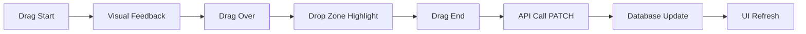

# 🎯 Kanban com Drag & Drop - Funcionalidades Trello

## ✨ **Funcionalidades Implementadas**

### 🖱️ **Drag and Drop**
- **Arrastar tickets** entre colunas de status (Aberto, Em Andamento, Pendente)
- **Visual feedback** durante o arraste com overlay customizado
- **Atualização automática** do status do ticket no banco de dados
- **Atribuição automática** quando movido para coluna de agente específico

### 🏗️ **Estrutura do Kanban**
- **Agrupamento por agentes** - cada agente tem suas próprias colunas
- **Seção "Não atribuídos"** - tickets sem responsável
- **Colunas colapsáveis** - permite focar em agentes específicos
- **Contadores visuais** - mostra quantidade de tickets por coluna/grupo

### 🎨 **Interface Visual**
- **Feedback visual** ao arrastar (zona de drop highlighted)
- **Cards responsivos** com informações completas do ticket
- **Badges de status e prioridade** com cores diferenciadas
- **Avatar do cliente** e informações da empresa

## 🔧 **Tecnologias Utilizadas**

### **@dnd-kit** (Biblioteca moderna para Drag & Drop)
- `@dnd-kit/core` - Core functionality
- `@dnd-kit/sortable` - Sortable containers
- `@dnd-kit/utilities` - Helper utilities

### **Vantagens do @dnd-kit**
- ✅ **Moderno e ativo** (substitui react-beautiful-dnd deprecated)
- ✅ **Performance superior** com virtual scrolling
- ✅ **Acessibilidade** completa com keyboard navigation
- ✅ **TypeScript nativo** com tipagem completa
- ✅ **Mobile-friendly** com touch support

## 🚀 **Como Usar**

### **1. Acessar o Kanban**
```
http://localhost:5000/tickets/kanban
```

### **2. Login no Sistema**
- **Usuário:** `admin`
- **Senha:** `admin123`

### **3. Testar Drag & Drop**
1. **Clicar e arrastar** um ticket de uma coluna
2. **Mover para outra coluna** (status diferente)
3. **Soltar** o ticket na nova posição
4. **Verificar atualização** automática no banco

### **4. Funcionalidades Adicionais**
- **Pesquisar tickets** usando a barra de busca
- **Filtrar por prioridade** usando o botão de filtro
- **Colapsar/expandir** grupos de agentes
- **Acessar detalhes** clicando no ticket

## 📊 **Dados de Exemplo**

O sistema possui uma base robusta de dados para teste:
- **12 usuários/agentes** com diferentes papéis
- **19 clientes** de empresas variadas
- **33 tickets** com status e prioridades diversas
- **7 templates de email** para comunicação

## 🎯 **Cenários de Teste**

### **Teste 1: Mover ticket entre status**
1. Arrastar ticket de "Aberto" para "Em Andamento"
2. Verificar mudança visual imediata
3. Confirmar atualização no banco

### **Teste 2: Atribuir ticket a agente**
1. Arrastar ticket de "Não atribuídos"
2. Soltar em coluna de agente específico
3. Verificar atribuição automática

### **Teste 3: Mudança de responsável**
1. Arrastar ticket entre agentes diferentes
2. Verificar reatribuição automática
3. Confirmar persistência da mudança

## 🔄 **Fluxo de Atualização**



## 🌟 **Melhorias Futuras**

### **Planejadas**
- [ ] **Reordenação** dentro da mesma coluna
- [ ] **Múltipla seleção** para mover vários tickets
- [ ] **Histórico de movimentações** no ticket
- [ ] **Notificações** para mudanças de responsável
- [ ] **Drag preview** com mais informações
- [ ] **Undo/Redo** para movimentações

### **Avançadas**
- [ ] **Kanban personalizado** por usuário
- [ ] **Colunas customizáveis** além dos status padrão
- [ ] **Drag & drop entre diferentes views** (lista → kanban)
- [ ] **Swimlanes** por prioridade ou categoria
- [ ] **Bulk operations** via drag & drop

## 🎉 **Status: ✅ Implementado com Sucesso!**

O Kanban agora possui funcionalidades completas de drag & drop, similares ao Trello, proporcionando uma experiência intuitiva e fluida para gerenciamento de tickets. 🚀
